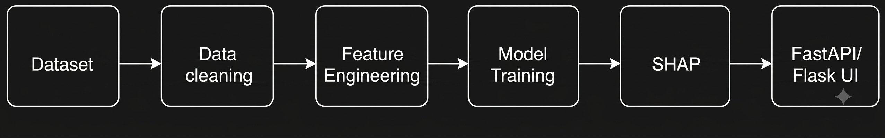
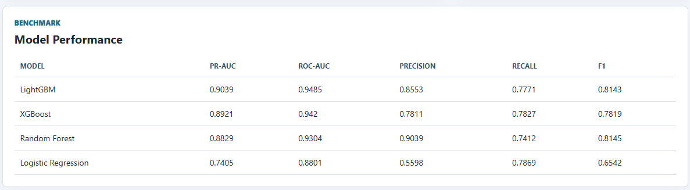
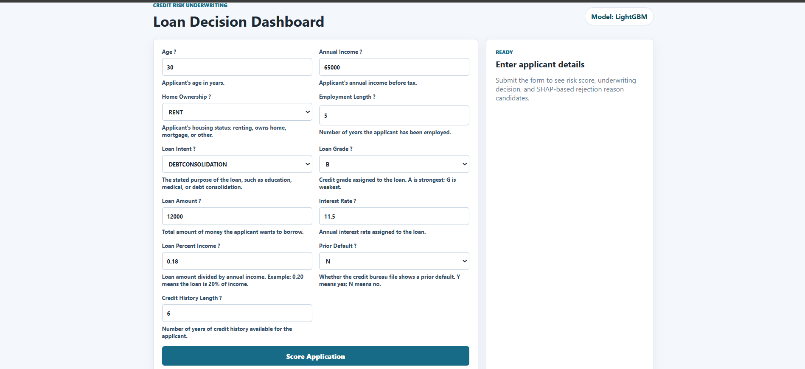
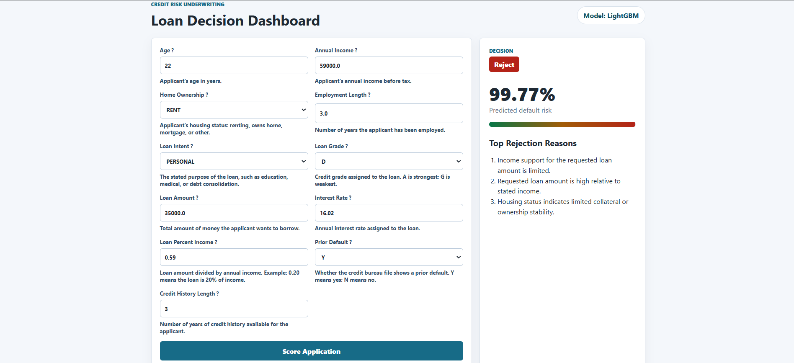
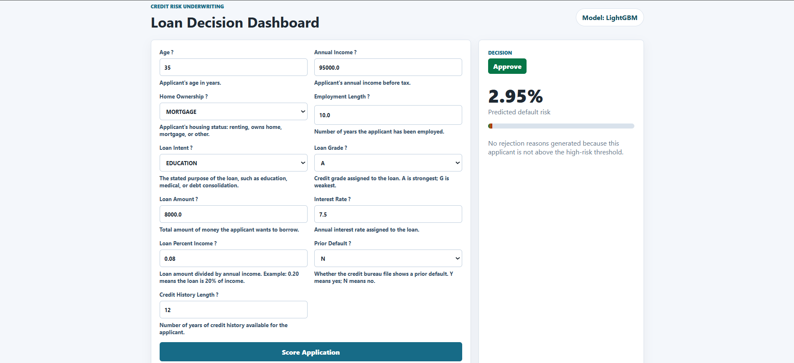
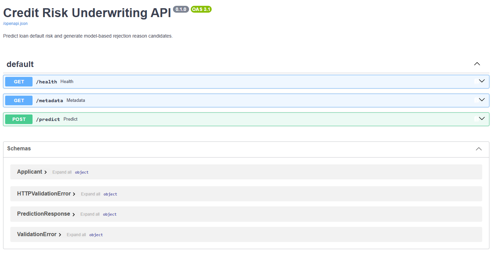

# Explainable Credit Risk Underwriting System

An end-to-end machine learning project for predicting loan default risk using a 32K+ Kaggle credit risk dataset. The system cleans missing values and outliers, engineers financial risk ratios, benchmarks multiple ML models, explains high-risk decisions with SHAP, and serves predictions through both a FastAPI backend and Flask dashboard.



## Highlights

- Built a complete credit risk pipeline covering data cleaning, train-test splitting, feature engineering, model benchmarking, explainability, API deployment, and UI delivery.
- Benchmarked Logistic Regression, Random Forest, XGBoost, and LightGBM using imbalanced-classification metrics including PR-AUC, ROC-AUC, Precision, Recall, and F1-score.
- Achieved best performance with LightGBM: **PR-AUC 0.9039** and **ROC-AUC 0.9485**.
- Integrated SHAP to generate the top three model-based rejection reason candidates for high-risk applicants.
- Deployed the final model using FastAPI endpoints and an interactive Flask loan-underwriting dashboard.

## Tech Stack

**Python**, **Pandas**, **NumPy**, **Scikit-learn**, **XGBoost**, **LightGBM**, **SHAP**, **FastAPI**, **Flask**, **Joblib**, **HTML**, **CSS**

## Project Workflow

1. Load the Kaggle credit risk dataset.
2. Split data into train and test sets using stratification.
3. Clean missing values and extreme outliers using training-set rules only.
4. Engineer financial features such as DTI proxy, interest burden, income-to-loan ratio, employment stability ratio, and credit history ratio.
5. Preprocess numeric and categorical features using a ColumnTransformer.
6. Train and benchmark Logistic Regression, Random Forest, XGBoost, and LightGBM.
7. Select the best model using PR-AUC.
8. Generate SHAP-based rejection reason candidates for high-risk applicants.
9. Serve predictions through FastAPI and a Flask dashboard.

## Model Performance



| Model | PR-AUC | ROC-AUC | Precision | Recall | F1 |
|---|---:|---:|---:|---:|---:|
| LightGBM | 0.9039 | 0.9485 | 0.8553 | 0.7771 | 0.8143 |
| XGBoost | 0.8921 | 0.9420 | 0.7811 | 0.7827 | 0.7819 |
| Random Forest | 0.8829 | 0.9304 | 0.9039 | 0.7412 | 0.8145 |
| Logistic Regression | 0.7405 | 0.8801 | 0.5598 | 0.7869 | 0.6542 |

## Dashboard

The Flask dashboard allows a user to enter applicant, loan, and credit-history details and receive a real-time underwriting decision.



### High-Risk Example

Input:

| Feature | Value |
|---|---:|
| Age | 22 |
| Annual Income | 59000 |
| Home Ownership | RENT |
| Employment Length | 3 |
| Loan Intent | PERSONAL |
| Loan Grade | D |
| Loan Amount | 35000 |
| Interest Rate | 16.02 |
| Loan Percent Income | 0.59 |
| Prior Default | Y |
| Credit History Length | 3 |

Expected output:

- **Decision:** Reject
- **Predicted default risk:** 99.77%
- **Top rejection reason candidates:** limited income support, high loan amount relative to income, limited housing ownership stability



### Low-Risk Example

Input:

| Feature | Value |
|---|---:|
| Age | 35 |
| Annual Income | 95000 |
| Home Ownership | MORTGAGE |
| Employment Length | 10 |
| Loan Intent | EDUCATION |
| Loan Grade | A |
| Loan Amount | 8000 |
| Interest Rate | 7.5 |
| Loan Percent Income | 0.08 |
| Prior Default | N |
| Credit History Length | 12 |

Expected output:

- **Decision:** Approve
- **Predicted default risk:** 2.95%
- **Rejection reasons:** none generated because the applicant is below the high-risk threshold



## FastAPI Backend

The backend exposes production-style endpoints for health checks, metadata, and prediction.



Endpoints:

| Method | Endpoint | Description |
|---|---|---|
| GET | `/health` | Checks API and artifact availability |
| GET | `/metadata` | Returns model name, threshold, input columns, and benchmark results |
| POST | `/predict` | Predicts default risk and returns decision plus rejection reason candidates |

Example prediction response:

```json
{
  "default_risk": 0.997658,
  "risk_band": "high",
  "decision": "reject",
  "rejection_reasons": [
    "Income support for the requested loan amount is limited.",
    "Requested loan amount is high relative to stated income.",
    "Housing status indicates limited collateral or ownership stability."
  ],
  "model_name": "LightGBM"
}
```

## Repository Structure

```text
CreditCard/
├── api.py
├── flask_app.py
├── train_pipeline.py
├── app.ipynb
├── artifacts/
│   └── model_bundle.joblib
├── assets/
│   ├── ui-dashboard.png
│   ├── high-risk-reject.png
│   ├── low-risk-approve.png
│   ├── model-metrics.png
│   ├── fastapi-docs.png
│   └── project-flow.png
├── credit_underwriting/
│   ├── __init__.py
│   └── pipeline.py
├── data/
│   └── credit_risk_dataset.csv
├── static/
│   └── style.css
└── templates/
    └── index.html
```

## How to Run

Install dependencies:

```bash
pip install pandas numpy scikit-learn xgboost lightgbm shap fastapi uvicorn flask joblib
```

Train and save the model bundle:

```bash
python train_pipeline.py
```

Run the FastAPI backend:

```bash
python -m uvicorn api:app --host 127.0.0.1 --port 8000
```

Open API docs:

```text
http://127.0.0.1:8000/docs
```

Run the Flask dashboard:

```bash
python flask_app.py
```

Open dashboard:

```text
http://127.0.0.1:5000/
```

## Resume Summary

**Explainable Credit Risk Underwriting System**

- Built an end-to-end loan default prediction pipeline on a **32K+ Kaggle credit risk dataset**, including train-only preprocessing, missing value imputation, outlier treatment, and financial feature engineering.
- Benchmarked **Logistic Regression**, **Random Forest**, **XGBoost**, and **LightGBM** using imbalanced-data metrics; achieved best performance with **LightGBM**, reaching **PR-AUC 0.9039** and **ROC-AUC 0.9485**.
- Integrated **SHAP explainability** and deployed real-time predictions through **FastAPI** and a **Flask dashboard** with model-based rejection reason candidates.

## Disclaimer

This project is for educational and portfolio use. SHAP-generated rejection reasons are model explanation candidates and should be reviewed for fair-lending, adverse-action, and regulatory compliance before any real-world credit decisioning use.
